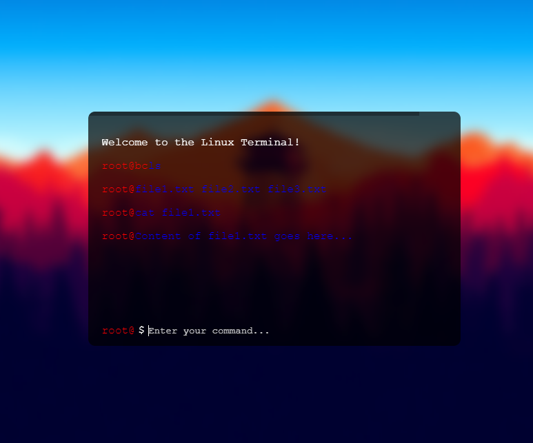

# Linux Terminal

A web-based Linux terminal simulation with a cool and stylish design.

## Description

The Linux Terminal project is a web application that emulates a Linux terminal environment in the browser. It provides users with a command-line interface to interact with and execute commands, just like a real Linux terminal.

The terminal interface is designed to resemble a classic Linux terminal with a modern twist. It features a sleek design, a customizable background image, and a transparent panel. The terminal supports syntax highlighting for the command prefix and displays the user-entered commands and their output in a scrollable content area.

## Features

- Emulates a Linux terminal in the browser
- Cool and stylish design with a customizable background image
- Transparent panel for a modern look
- Syntax highlighting for the command prefix
- Scrollable content area to view command history
- Customizable and easy to use

## Installation

To use the Linux Terminal project, follow these steps:

1. Clone the repository: `git clone https://github.com/your-username/linux-terminal.git](https://github.com/kristianbc/Terminal.git`
2. Open the `index.html` file in your web browser.
3. Start interacting with the terminal.

## Usage

Once the terminal is open in your web browser, you can start using it as follows:

1. Enter your username when prompted.
2. Type commands directly in the terminal after the command prefix.
3. Press Enter to execute the command.
4. View the command output in the terminal content area.

## Customization

The Linux Terminal project can be customized in the following ways:

- Background Image: Replace the `background-image.jpg` file in the project directory with your desired background image.
- Colors: Modify the color values in the CSS code to change the appearance of the terminal.

## Contributing

Contributions to the Linux Terminal project are welcome! If you have any ideas, improvements, or bug fixes, please feel free to submit a pull request. For major changes, please open an issue first to discuss the changes.

## License

This project is licensed under the [MIT License](LICENSE).

## Contact

If you have any questions or suggestions regarding this project, please feel free to contact me:

- Email: [your email address]
- GitHub: [your GitHub username]
- Twitter: [your Twitter handle]

